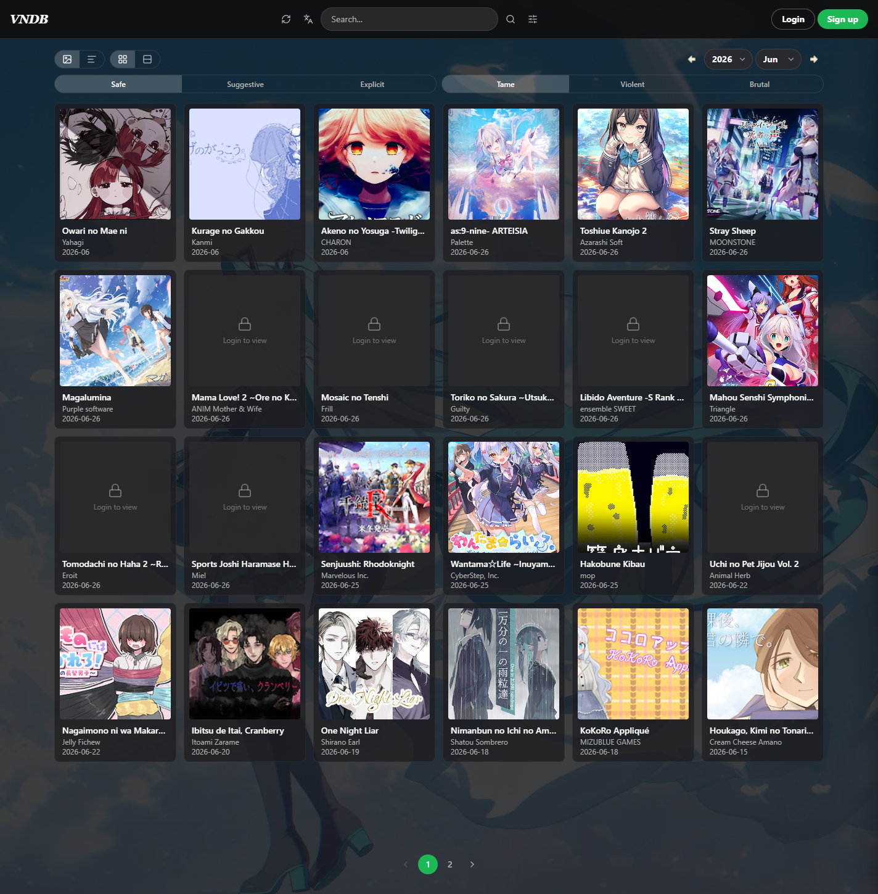
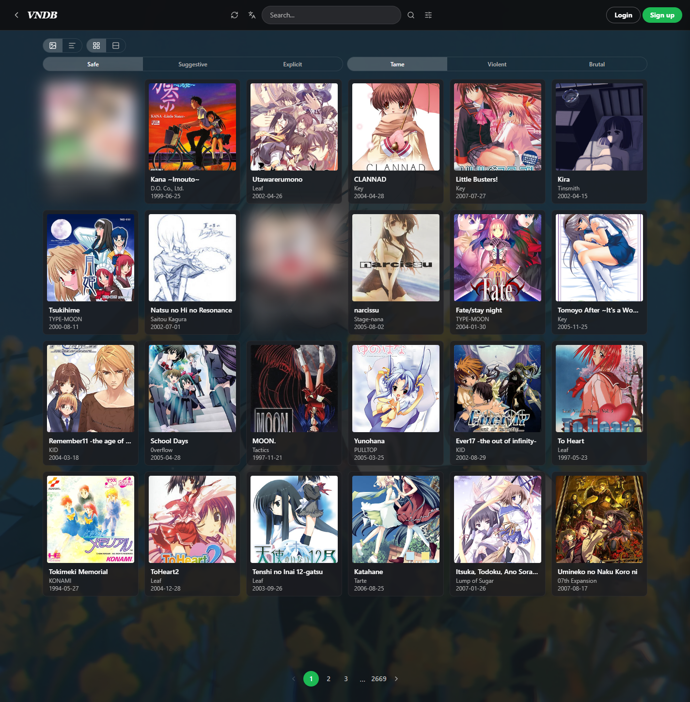
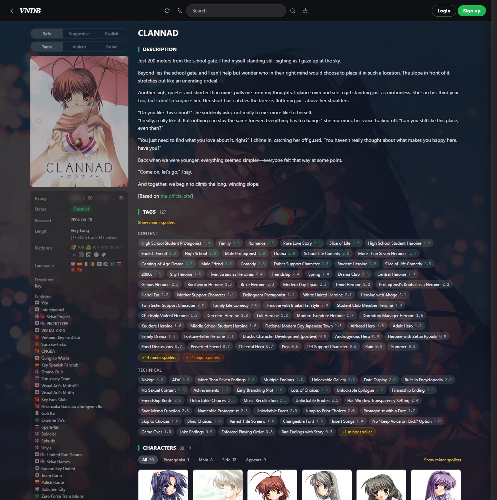
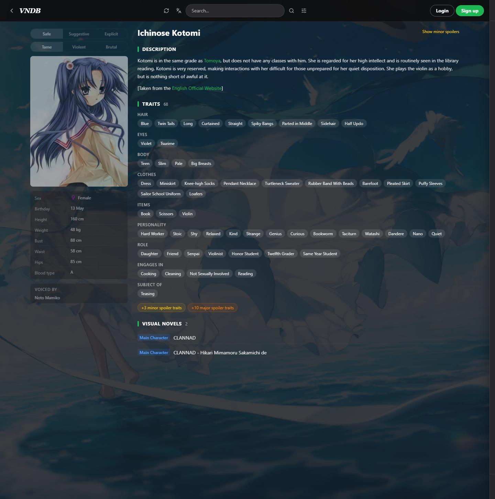
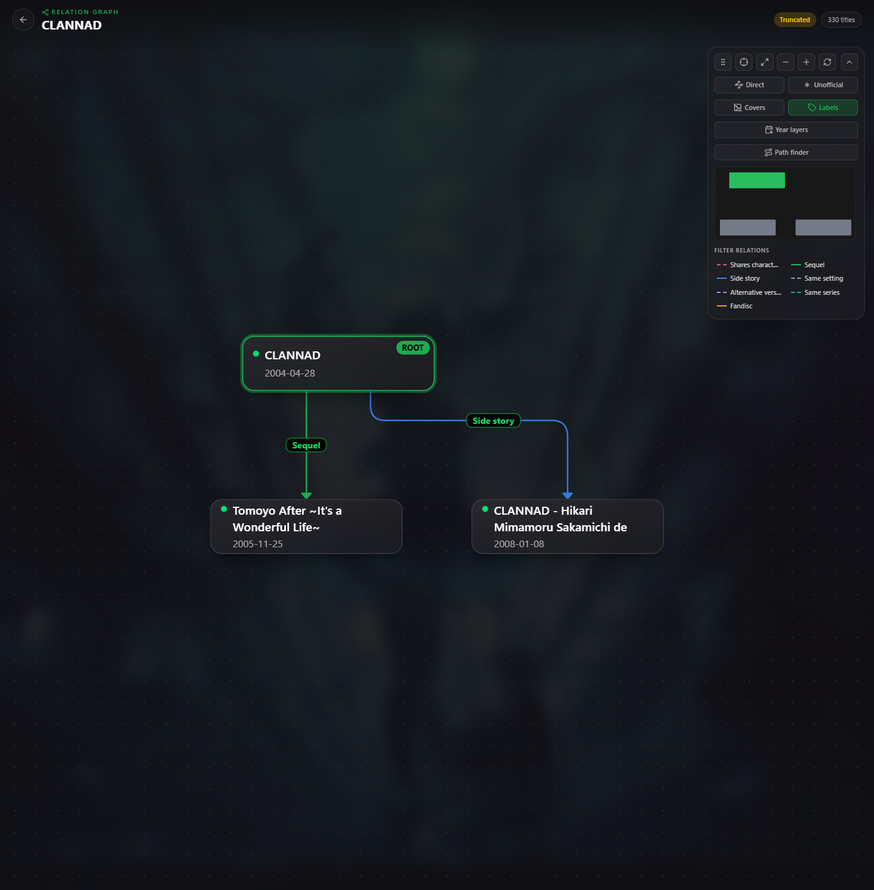

<div align="center">

# 🌸 Visual Novel Database 🌸

*A self-hosted, re-imagined clone of [vndb.org](https://vndb.org/), built on the [VNDB Kana API](https://api.vndb.org/kana).*

</div>

---

## Overview

This project mirrors the data behind [vndb.org](https://vndb.org/) into a **local database**, wraps it
in a set of small Flask services, and serves it through a **freshly redesigned Next.js frontend**.
On top of the original VNDB feature set it adds **user accounts**, **localized images & media**, and
a **Japanese translation layer** for tag/trait descriptions.

## Preview

<table>
  <tr>
    <td colspan="2"><br/><sub><b>Home</b> — recent releases, browsable by year/month</sub></td>
  </tr>
  <tr>
    <td width="50%"><br/><sub><b>Browse</b> — search grid with content-level filtering</sub></td>
    <td width="50%"><br/><sub><b>VN detail</b> — tags, releases, staff &amp; cast</sub></td>
  </tr>
  <tr>
    <td width="50%"><br/><sub><b>Character detail</b> — traits &amp; appearances</sub></td>
    <td width="50%"><br/><sub><b>Relation graph</b> — interactive VN relations</sub></td>
  </tr>
</table>

> Screenshots are shown in all-ages (Safe) mode.

## Backend

A handful of focused Flask apps, orchestrated by a single launcher and fronted by Caddy.

| App | Purpose |
| --- | --- |
| **vndb** | Core API. Crawls the Kana API into local Postgres and serves VNs, releases, producers, characters, staff, tags & traits, plus search (local / remote / both). |
| **imgserve** | Localizes and serves images (covers, screenshots) with caching. |
| **userserve** | User accounts — registration, JWT auth, email, and personal collections/lists. |
| **transserve** | Translation layer — stores and serves en→ja translations of tag/trait descriptions. |
| **musicserve** | Serves the local music library for the player. |
| **logserve** | Developer tool to browse, filter & replay recorded searches (the `logs` table). Loopback-only — not behind Caddy. |
| **procserve** | Process supervisor used by the launcher to start/manage all services. |

## Frontend

A single Next.js app. Most browsing flows through one catch-all route.

Routes are relative to the app's basePath — `/v17` is served at
`/visual-novel-database/v17`. See *Running* below.

| Route | Shows |
| --- | --- |
| `/` | Home — recent releases by year/month. |
| `/[type]` (`v r p c s g i`) | Search results for VNs, releases, producers, characters, staff, tags, traits. |
| `/[type][id]` (e.g. `/v17`) | Detail page for a single entity. |
| `/[type][id]/rg` | Relation graph for a visual novel. |
| `/u/c` | User collections — browse, search, sort & bulk-edit marked items. |
| `/kobayashi` | A bespoke, music-player showcase of a user's VN collection. |
| `/reset-password` | Password reset. |

## Running

The whole app — backend, frontend and the Caddy edge — is one launcher:

```powershell
.\start-prod.ps1 -Build     # prod stack; drop -Build once it is built
.\start-prod.ps1 -Dev       # dev stack (Flask dev servers + next dev)
```

Caddy is the only public ingress. It listens on `:30709` and routes by path
prefix (see `Caddyfile.snippet`); the frontend lives under **`/visual-novel-database`**,
not at the origin root, because one public port may front several apps — see
`../AppGateway/`. Open <http://localhost:30709>, which redirects there.

> Requires **PostgreSQL**, **Redis** and **Caddy** on PATH, plus
> [Pixi](https://pixi.sh/) for the backend env (`backend/scripts/pixi-setup.ps1`).
> Copy `backend/.env.sample` → `backend/.env` and adjust before first run.

### Running a half on its own

```bash
cd backend  && pixi run dev     # backend only: Flask + Celery + Redis, no edge
cd frontend && npm run dev      # frontend only: http://localhost:5010/visual-novel-database
```

## Acknowledgements

Heartfelt thanks to the **[VNDB](https://vndb.org/)** team and the **[Kana API](https://api.vndb.org/kana)**
developers, and to every contributor who has added and maintained the content on VNDB — this project would
not exist without their work.
